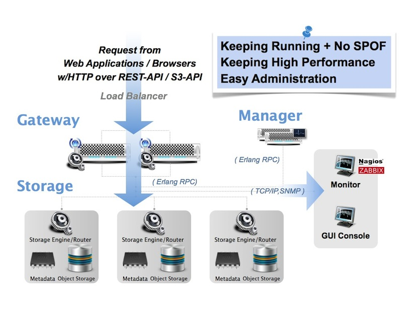

# LeoFS, A Storage System for a Data Lake and the Web
## Why LeoFS?

LeoFS is a highly available, distributed, eventually consistent object/blob store. If you are searching a storage system that is able to store huge amount and various kind of raw data in its native format, LeoFS is suitable for that.

LeoFS supports the following features:

* Multi protocols support
	* RESTful Interface
	* Amazon S3-API[^1]
		* A S3 compatible storage system
		* Switch to LeoFS to decrease your cost from more expensive public-cloud solutions.
	* NFS v3[^2]
* Built-in object cache feature
* Multi data center/cluster replication
* User and bucket management
* Data lake solution
* Cloud solution integration

## About

LeoFS provides High Cost Performance Ratio. It allows you to build LeoFS clusters using commodity hardware on top of the Linux operating system. LeoFS will provide very good performance even on commodity hardware. LeoFS will require a smaller cluster than other storage to achieve the same performance. LeoFS is also very easy to setup and to operate.

LeoFS provides High Reliability thanks to its great design on top of the Erlang/OTP capabilities. Erlang/OTP is known for being used in production systems for years with a solid nine nines (99.9999999%) availability, and LeoFS is no exception. A LeoFS system will stay up regardless of software errors or hardware failures happening inside the cluster.

LeoFS provides High Scalability. Adding and removing nodes is simple and quick, allowing you to react swiftly when your needs change. A LeoFS cluster can be thought as elastic storage that you can stretch as much and as often as you need.

LeoFS consists of three components - LeoStorage, LeoGateway and LeoManager which depend on Erlang.

[LeoGateway](./architecture/leo_gateway.md) handles http-request and http-response from any clients when using REST-API OR S3-API. Also, it is already built in the object-cache mechanism, memory and disk cache.

[LeoStorage](./architecture/leo_storage.md) handles GET, PUT and DELETE objects as well as metadata. Also, it has replicator, recoverer and queueing mechanism in order to keep running a storage node and realize eventual consistency.

[LeoManager](./architecture/leo_manager.md) always monitors LeoGateway and LeoStorage nodes. The main monitoring status are Node status and RING’s checksum in order to realize to keep high availability and keep data consistency.

## Getting Started

To try LeoFS, see our [Getting Started guides](installation/quick.md), and to learn more about LeoFS, see our [Architecture section](architecture/README.md).

## Goals

We have been aiming to achieve three things:

* High reliability and availability
  * Operating ratios is 99.9999999%, nine nines
  * Keeps maintaining high data and system availability while some node downed in a LeoFS' cluster
* High scalability
  * Builds a huge capacity cluster at low cost
  * Supports a multi data center/cluster replication
* High cost performance ratio
  * High performance with minimum resources
  * Provides easy management and easy operation to users

## Resources

- <a href="http://leo-project.net/leofs/" target="_blank">LeoFS Website</a>
- <a href="https://github.com/leo-project/leofs" target="_blank">LeoFS Repository on GitHub </a>
- LeoFS Download Page
	- <a href="http://leo-project.net/leofs/download.html" target="_blank">LeoFS Package for CentOS and Ubuntu</a>
	- <a href="http://www.freshports.org/databases/leofs" target="_blank">LeoFS Package for FreeBSD </a>

[^1]: <a href="http://docs.aws.amazon.com/AmazonS3/latest/API/Welcome.html" target="_blank">Amazon S3 API</a>
[^2]: <a href="https://en.wikipedia.org/wiki/Network_File_System" target="_blank">Wikipedia: Network File System</a>
