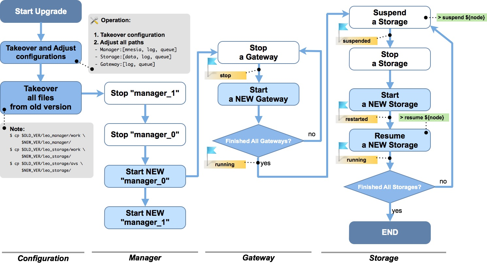

# System Migration

## Upgrade an old version LeoFS to v1.3.3
### Operation Flow

If you would like to migrate a LeoFS system, you can achieve that by following the operation flow.



- <a href="../../../assets/leofs-upgrade-flow-diagram.jpg" target="_blank">See the large diagram</a>

#### Takeover and Adjust Confugurations

Before getting started with the migration of a LeoFS system, you need to take over the configuration, then adjust the paths and set the new configurations.


#### Added Or Changed LeoFS' Configurations
##### Added the Configurations of LeoManager Master

**LeoFS' MDC replication feature** was improved. Some configuration are added in [the configuration of LeoManager's master](https://github.com/leo-project/leofs/blob/master/apps/leo_manager/priv/leo_manager_0.conf).


```ini
## --------------------------------------------------------------------
## MANAGER - Multi DataCenter Settings
## --------------------------------------------------------------------
## A number of replication targets
mdc_replication.max_targets = 2

## A number of replicas per a datacenter
## [note] A local LeoFS sends a stacked object which contains an items of a replication method:
##          - [L1_N] A number of replicas
##          - [L1_W] A number of replicas needed for a successful WRITE operation
##          - [L1_R] A number of replicas needed for a successful READ operation
##          - [L1_D] A number of replicas needed for a successful DELETE operation
##       A remote cluster of a LeoFS system which receives its object,
##       and then replicates it by its contained reoplication method.
mdc_replication.num_of_replicas_a_dc = 1

## MDC replication / A number of replicas needed for a successful WRITE operation
mdc_replication.consistency.write = 1

## MDC replication / A number of replicas needed for a successful READ operation
mdc_replication.consistency.read = 1

## MDC replication / A number of replicas needed for a successful DELETE operation
mdc_replication.consistency.delete = 1
```


### About LeoFS' Package

Starting from v1.3.3, all LeoFS nodes are running as non-privileged user `leofs` in [the official Linux packages](http://leo-project.net/leofs/download.html). It should work out of the box for new installations and for new nodes on existing installations. However, for existing nodes upgrading to v1.3.3 *(or later)* from previous versions, the change might be not seamless.


### Extra Steps
#### Running LeoFS with Default Paths

For those who have LeoFS configured with:

- `queue` and `mnesia` in `/usr/local/leofs/<version>/leo_*/work`
- `log files` in `/usr/local/leofs/<version>/leo_*/log`
- LeoStorage data files in `/usr/local/leofs/<version>/leo_storage/avs`

#### Procedures
##### Migrate Files and Directories

During upgrade of node *(of any type)*, **after** stopping the old version and copying or moving every files to be moved into the new directories, change the owner with the commands below. It has to be done **before** launching the
new version.

```
# chown -R leofs:leofs /usr/local/leofs/%version/leo_storage/avs
# chown -R leofs:leofs /usr/local/leofs/%version/leo_gateway/cache
# chown -R leofs:leofs /usr/local/leofs/%version/leo_*/log
# chown -R leofs:leofs /usr/local/leofs/%version/leo_*/work
```

##### Remove Unnecessary Directories

Remove old temporary directory used by launch scripts. This step is needed because when earlier version was launched with `root` permissions, it creates a set of temporary directories in `/tmp` which cannot be re-used by non-privileged user as is, and launch scripts will fail with obscure messages - or with no message at all, except for an error in syslog *(usually `/var/log/messages`)*.

```
# rm -rf /tmp/usr
```

##### Re-launch the System

Start the node through its launch script, as per upgrade flow diagram.


#### Running LeoFS with customized paths

For those who have LeoFS configured with, for example:

- `queue` and `mnesia` in `/mnt/work`
- `log files` in `/var/log/leofs`
- LeoStorage data files in `/mnt/avs`


1. Before starting new version of a node, execute `chown -R leofs:leofs <..>` for all these external directories

2. Don't forget to remove temporary directory *(`rm -rf /tmp/usr`)* as well for the reasons described above.

These users might be interested in new features of `environment config files`, which allow to redefine some environment variables like paths in launch script.

Refer [For Administrators / Settings / Environment Configuration](/admin/settings/environment_config.md) for more information.


#### Running LeoFS with customized launch scripts

For those who have LeoFS already running as non-privileged user.

1. Scripts that are provided by packages generally should be enough to run on most configurations without changes. If needed, change user from `leofs` to some other in "environment" config files *(e.g. `RUNNER_USER=localuser`)*. Refer to the later section for more details about environment config files.

2. Possible pitfall includes ownership of `/usr/local/leofs/.erlang.cookie` file, which is set to `leofs` during package installation. This should only be a problem when trying to run LeoFS nodes with permissions of some user which is not called `leofs`, but has home directory set to `/usr/local/leofs`. This is not supported due to technical reasons. Home directory of that user must be set to something else.


#### Running LeoFS in any form and keeping LeoFS running as `root`

For those who want to keep maximum compatibility with the previous installation.
In `environment config file`, set `RUNNER_USER`:

```ini
RUNNER_USER=root
```

Note that switching this node to run as non-privileged user later will require extra steps to carefully change all permissions. This is not recommended, but possible *(at very least, in addition to `chown` commands from before, permissions of `leo_*/etc` and `leo_*/snmp/*/db` will have to be changed recursively as well)*.


## Note for Developers

As described at the previous section, the default user running LeoFS processes has changed to `leofs` so that requires developers to

- Tweak environment config files to set `RUNNER_USER` to the user you have logged in while developing with ```make release/bootstrap.sh/mdcr.sh```.
- Remove all files under `$PIPE_DIR` before starting any LeoFS processes.


## Related Links

- [For Administrators / Settings / Environment Configuration](/admin/settings/environment_config.md)
- [For Administrators / Settings / LeoManager Settings](/admin/settings/leo_manager.md)
- [For Administrators / Settings / LeoStorage Settings](/admin/settings/leo_storage.md)
- [For Administrators / Settings / LeoGateway Settings](/admin/settings/leo_gateway.md)
